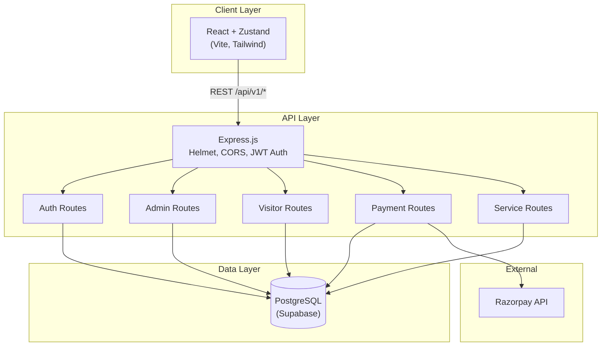
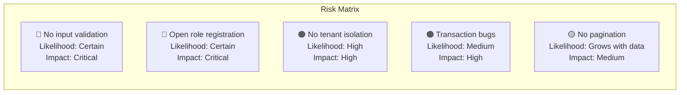

# Smart Apartment Management Platform — Architecture Review

> **Reviewer:** Senior System Architect (CTO-level)
> **Date:** March 19, 2026
> **Scope:** Full-stack review — Database, Backend APIs, Frontend, Security, Scalability

---

## Executive Summary

The platform has a solid foundation: a well-normalized PostgreSQL schema with UUIDs, a clean Express backend with JWT auth, and a modern React + Zustand + Vite frontend. However, **the system is not yet production-ready.** There are critical gaps in security, input validation, multi-tenancy isolation, and real-time capabilities that must be addressed before deployment.

Below, I break down findings by priority (**P0** = blocking for production, **P1** = high-risk, **P2** = important, **P3** = recommended).

---

## 1. Architecture Diagram



### Current File Structure

```
tdpcl/
├── src/                          # Backend (Node.js + Express)
│   ├── app.js                    # Entry point, middleware, route mounting
│   ├── config/db.js              # pg Pool (Supabase connection)
│   ├── controllers/              # 5 controllers (auth, admin, visitor, payment, services)
│   ├── middlewares/               # auth.middleware.js, error.middleware.js
│   ├── routes/                   # 5 route files
│   └── utils/jwt.js              # JWT sign/verify helpers
├── client/                       # Frontend (React + Vite)
│   └── src/
│       ├── api/axios.js          # Axios instance + interceptors
│       ├── store/useAuthStore.js  # Zustand auth state
│       ├── pages/                # 7 page groups (auth, dashboard, emergency, parking, payments, vendors, visitors)
│       └── components/           # Reusable UI components
└── supabase_schema.sql           # 15 tables, indexes, triggers
```

---

## 2. What's Done Well ✅

| Area | Assessment |
|---|---|
| **Database schema** | Well-normalized, UUID primary keys, `CHECK` constraints on enum columns, composite unique constraints, useful indexes, `updated_at` trigger |
| **API versioning** | `/api/v1/` prefix — future API evolution supported |
| **RBAC middleware** | `requireAuth` + `requireRole` pattern is clean and composable |
| **Error handling** | `AppError` class + global error handler with dev/prod distinction |
| **Payment flow** | Proper Razorpay order → verify → update chain with HMAC signature verification |
| **Transaction safety** | `BEGIN/COMMIT/ROLLBACK` in multi-step mutations (visitor pass, parking assignment, payments) |
| **Frontend auth** | Axios interceptors for token injection + 401 auto-logout |

---

## 3. Critical Findings (P0 — Production Blockers)

### 3.1 🔴 No Input Validation on ANY Endpoint

**Risk:** SQL injection via malformed UUIDs, XSS via stored text fields, type coercion errors

**Impact:** Every controller trusts `req.body` and `req.query` blindly. While parameterized queries protect against traditional SQL injection, there's no schema validation ensuring correct types, lengths, or formats.

**Fix:** Add Joi validation middleware (already in `package.json` but **never used**).

```
// Recommended: src/middlewares/validate.middleware.js
const validate = (schema) => (req, res, next) => {
  const { error } = schema.validate(req.body, { abortEarly: false });
  if (error) return res.status(400).json({ success: false, errors: error.details });
  next();
};
```

---

### 3.2 🔴 Open Registration — Anyone Can Register as Any Role

In [auth.controller.js](file:///c:/Users/santh/OneDrive/Desktop/tdpcl/src/controllers/auth.controller.js#L8):

```javascript
const { email, phone, password, full_name, role } = req.body;
// role is accepted from the request body — any user can register as 'admin' or 'super_admin'
```

**Fix:** Strip `role` from public registration. Only allow admins to assign roles via the admin endpoint.

---

### 3.3 🔴 Same JWT Secret for Access & Refresh Tokens

In [jwt.js](file:///c:/Users/santh/OneDrive/Desktop/tdpcl/src/utils/jwt.js), both `signAccessToken` and `signRefreshToken` use `process.env.JWT_SECRET`.

**Risk:** If an access token is intercepted, it cannot be differentiated from a refresh token at the signature level. Use **two separate secrets** (`JWT_ACCESS_SECRET`, `JWT_REFRESH_SECRET`).

---

### 3.4 🔴 Refresh Tokens Are Not Stored or Revocable

The refresh token flow issues a JWT but never stores it server-side. This means:
- Tokens **cannot be revoked** (stolen token is valid for 7 days)
- No **single-sign-out** capability
- No **token rotation** on refresh

**Fix:** Store refresh tokens in a `refresh_tokens` table (or Redis) with `user_id`, `token_hash`, `expires_at`, and `revoked_at`.

---

### 3.5 🔴 No Multi-Tenancy (Complex-Level) Data Isolation

The schema supports multi-apartment via `complexes → buildings → units`, but **no controller or middleware enforces complex-level scoping.**

Examples:
- `listUnits` returns ALL units across ALL complexes
- `listEmergencies` returns ALL alerts across ALL complexes
- A resident in Complex A can raise a vendor request for a unit in Complex B

**Fix:** Add `complex_id` to user context (via `user_units → units → buildings → complexes`) and enforce it in a middleware or query filter on every request.

---

### 3.6 🔴 Database Credentials Committed to Source

The `.env` file contains the actual Supabase `DATABASE_URL` with password. If this repo is on GitHub, the database is fully exposed.

**Fix:** Add `.env` to `.gitignore`, use environment variable injection in CI/CD.

---

## 4. High-Risk Findings (P1)

### 4.1 🟠 No Rate Limiting

No rate limiting on any endpoint. Login brute-force, payment spam, and emergency alert floods are all possible.

**Fix:** Add `express-rate-limit` globally + stricter limits on `/auth/login` and `/payments/*`.

---

### 4.2 🟠 Transaction Isolation Bug in `assignUserToUnit`

In [admin.controller.js](file:///c:/Users/santh/OneDrive/Desktop/tdpcl/src/controllers/admin.controller.js#L165-L189), `BEGIN`/`COMMIT`/`ROLLBACK` runs on the shared pool connection (not a dedicated client), so:
- The transaction may interleave with other queries
- Concurrent requests could break isolation

**Fix:** Use `pool.connect()` to get a dedicated client, run the transaction, then `client.release()`.

```javascript
const client = await pool.connect();
try {
  await client.query('BEGIN');
  // ... transactional queries using client.query()
  await client.query('COMMIT');
} catch (err) {
  await client.query('ROLLBACK');
  throw err;
} finally {
  client.release();
}
```

> [!CAUTION]
> This same bug exists in **all** controllers that use transactions: `visitor.controller.js`, `payment.controller.js`, and `services.controller.js`. All must be fixed.

---

### 4.3 🟠 Payment Verification Lacks User Authorization Check

In [payment.controller.js](file:///c:/Users/santh/OneDrive/Desktop/tdpcl/src/controllers/payment.controller.js#L104), `verifyPayment` accepts any authenticated user's request to verify any payment — there's no check that the user owns the invoice.

**Fix:** Join on `payments → invoices → user_units → users` to verify ownership before updating.

---

### 4.4 🟠 CORS is Wide Open

```javascript
app.use(cors());  // Accepts ALL origins
```

**Fix:** Restrict to your frontend domain(s):
```javascript
app.use(cors({ origin: ['https://yourdomain.com'], credentials: true }));
```

---

### 4.5 🟠 No Razorpay Webhook Handler

The current flow relies on the frontend to call `/payments/verify`. If the frontend fails or the user closes the browser, the payment is captured by Razorpay but never reflected in your database.

**Fix:** Implement a `/webhooks/razorpay` endpoint that:
- Validates the webhook signature using `RAZORPAY_WEBHOOK_SECRET`
- Updates payment + invoice status server-side
- Is idempotent (handles duplicate events)

---

## 5. Important Findings (P2)

### 5.1 🟡 No Service Layer (Fat Controllers)

Controllers directly contain business logic AND database queries. This violates separation of concerns and makes testing difficult.

**Recommended structure:**
```
src/
├── controllers/     # HTTP request/response only
├── services/        # Business logic
├── repositories/    # SQL queries and data access
├── middlewares/
├── validators/      # Joi schemas
├── routes/
└── utils/
```

---

### 5.2 🟡 No Pagination on List Endpoints

`listUsers`, `listUnits`, `listMyInvoices`, `listVendors` return ALL rows. As data grows, these will become performance bottlenecks.

**Fix:** Add `LIMIT`, `OFFSET` (or cursor-based) pagination with standard response format:
```json
{ "data": [...], "meta": { "page": 1, "limit": 20, "total": 143 } }
```

---

### 5.3 🟡 No Audit/Activity Log Table

For a management platform dealing with payments and access control, there's no record of who did what and when (beyond `created_at`).

**Recommended:** Add an `audit_logs` table:
```sql
CREATE TABLE audit_logs (
  id         UUID PRIMARY KEY DEFAULT uuid_generate_v4(),
  user_id    UUID REFERENCES users(id),
  action     VARCHAR(100) NOT NULL,  -- e.g. 'PAYMENT_VERIFIED', 'USER_DEACTIVATED'
  entity     VARCHAR(50),            -- e.g. 'invoice', 'user'
  entity_id  UUID,
  metadata   JSONB,
  ip_address INET,
  created_at TIMESTAMPTZ NOT NULL DEFAULT now()
);
```

---

### 5.4 🟡 No Real-Time Capabilities for Emergency Alerts

The `triggerEmergency` controller has a TODO for WebSocket/Push notifications. For a production emergency system, this is not optional.

**Fix:** Add Socket.IO or Supabase Realtime to push alerts to admin/security dashboards instantly.

---

### 5.5 🟡 Missing `checked_out_at` Handling for Visitors

The visitor schema has `checked_in_at` but the API only handles check-in, not check-out. There's no endpoint to mark a visitor as `checked_out`.

---

### 5.6 🟡 No Password Strength Enforcement

Registration accepts any password string. No minimum length, complexity, or breach-check validation.

---

### 5.7 🟡 Frontend Stores Token in localStorage

`localStorage` is vulnerable to XSS. For a payment-handling platform:
- Store access tokens in **memory** (Zustand state, not persisted)
- Store refresh tokens in **httpOnly cookies**

---

## 6. Recommended Improvements (P3)

| # | Improvement | Benefit |
|---|---|---|
| 1 | Add **request logging** (morgan/pino) | Debugging, monitoring, compliance |
| 2 | Add **health check with DB ping** | Load balancer / orchestrator readiness |
| 3 | Implement **soft deletes** (`deleted_at`) on users & units | Data retention, undo capability |
| 4 | Add **notification system** (email/SMS/push) | Payment reminders, visitor alerts, emergency broadcasts |
| 5 | Add **API documentation** (Swagger/OpenAPI) | Frontend team alignment, testing |
| 6 | Implement **CI/CD pipeline** | Automated testing, deployment |
| 7 | Add **database migrations** (Knex/Prisma) | Schema versioning, team collaboration |
| 8 | Add **compression** middleware | Reduce payload size by ~70% |
| 9 | Implement **caching** (Redis) for static lookups | Faster vendor lists, parking availability |
| 10 | Add **file upload** support (S3/Supabase Storage) | Avatar uploads, maintenance request photos |

---

## 7. Missing Backend Routes

| Module | Missing Endpoints |
|---|---|
| **Visitors** | `GET /visitors` (list my passes), `POST /visitors/:id/checkout`, `DELETE /visitors/:id` (cancel) |
| **Parking** | `GET /parking/my-assignments`, `DELETE /parking/assignments/:id` (release slot) |
| **Vendors** | `GET /vendor-requests` (list my requests), `PATCH /vendor-requests/:id` (update status), `POST /admin/vendors` (add vendor) |
| **Emergency** | `PATCH /emergencies/:id` (acknowledge/resolve) |
| **Admin** | `GET /admin/complexes`, `GET /admin/buildings`, `GET /admin/dashboard/stats` |
| **User** | `PATCH /auth/me` (update profile), `POST /auth/change-password`, `POST /auth/forgot-password` |

---

## 8. Risks & Bottlenecks



| Risk | Description | Mitigation |
|---|---|---|
| **Data leak across complexes** | No complex-level scoping means Resident A can see Resident B's data from another apartment complex | Add `complex_id` scoping middleware |
| **Payment reconciliation gaps** | Without webhooks, payments captured by Razorpay may never update locally | Implement webhook handler + daily reconciliation job |
| **Single point of failure** | No horizontal scaling, no load balancer, no process manager | Deploy with PM2/Docker + ALB in production |
| **No monitoring** | No APM, no error tracking, no alerting | Add Sentry (errors) + CloudWatch/Prometheus (metrics) |

---

## 9. Production Deployment Checklist

- [ ] Fix all P0 items (validation, role registration, JWT secrets, tenant isolation, .env)
- [ ] Fix all P1 items (rate limiting, transaction isolation, CORS, webhook)
- [ ] Add database migrations (stop running raw SQL in production)
- [ ] Set up CI/CD (GitHub Actions → build → test → deploy)
- [ ] Deploy backend behind a reverse proxy (Nginx/ALB) with HTTPS termination
- [ ] Enable Supabase Row Level Security (RLS) as an additional access control layer
- [ ] Set up monitoring (Sentry + uptime checks)
- [ ] Configure proper logging with log rotation
- [ ] Run a security audit / penetration test
- [ ] Load test critical paths (login, payment, emergency)

---

> [!IMPORTANT]
> **Bottom line:** The architecture is conceptually sound and the schema is production-grade. However, the backend needs a security hardening pass (P0 items) and structural improvements (service layer, validation, pagination) before going live. The P0 fixes are ~2–3 days of focused effort. P1+P2 items add another ~1 week. I recommend tackling them in priority order before any new feature work.
